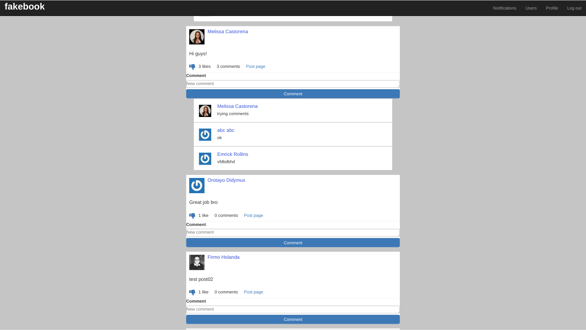

# Odin Facebook

 The project consisted of creating a social network similar to [Facebook](facebook.com). With the implementation of Facebook's main functionalities.
 - Users can create a profile page
   - Before a user signs in/signs up they can only see the Welcome page
   - When they log in they have access to the whole app
 - Users can create posts
 - Users can add comments on posts
 - Users can 'like' posts
 - Users can add friends
   - One user sends a friend request to another user
   - The second user must first accept the friend request so they can become friends
 - Users can log in with a real Facebook account

 The original project requirments can be found on The Odin Project - [Odin Facebook](https://www.theodinproject.com/courses/ruby-on-rails/lessons/final-project )

 

 The Live Version - [Fakebook](https://afternoon-river-58456.herokuapp.com/)

## Built With

- Ruby (version 2.6.3)
- Ruby on Rails (version 5.2.4)

- Gems
  - gem 'devise'
  - gem 'omniauth-facebook'
  - gem 'pg'
  - gem 'bootstrap-sass'
  - gem 'font-awesome-rails'
  - gem 'rspec'
  - gem 'capybara'

## Authors

👤 **Ermin Cahtarevic**

- Github: [@ermin-cahtarevic](https://github.com/ermin-cahtarevic)
- Linkedin: [ermincahtarevic](https://www.linkedin.com/in/ermincahtarevic/)

👤 **Vashira Samaila**

- Github: [@Vashiramusa](https://github.com/Vashiramusa)
- Linkedin: [vashirasamaila](https://www.linkedin.com/in/vashirasamaila/)

## 🤝 Contributing

Contributions, issues and feature requests are welcome!

Feel free to check the [issues page](https://github.com/ermin-cahtarevic/odin-facebook/issues).

## Show your support

Give a ⭐️ if you like this project!

## Acknowledgments

- [Microverse](https://www.microverse.org/)
- [The Odin Project](https://www.theodinproject.com/)
- [Devise](https://github.com/heartcombo/devise)
